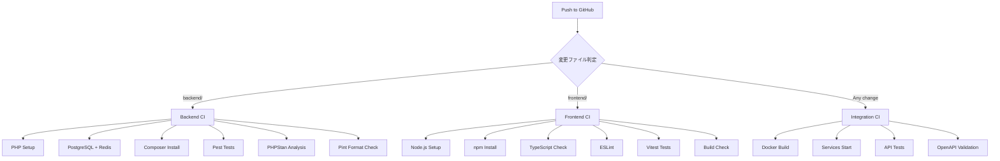

# PICC CI/CD Configuration

このディレクトリには、PICCプロジェクトのGitHub Actions CI/CD設定が含まれています。

## ワークフロー構成

### 1. Backend CI (`backend-ci.yml`)
**トリガー**: `backend/` ディレクトリ内のファイル変更時

**実行内容**:
- 🧪 **Pest テスト実行** (Unit + Feature)
- 🔍 **PHPStan 静的解析** (Level 8)
- 🎨 **Laravel Pint コードフォーマットチェック**
- 🔒 **Composer セキュリティ監査**
- 📊 **テストカバレッジ測定**

**環境**:
- PHP 8.3 + 拡張モジュール (pgsql, redis)
- PostgreSQL 15
- Redis 7

### 2. Frontend CI (`frontend-ci.yml`)
**トリガー**: `frontend/` ディレクトリ内のファイル変更時

**実行内容**:
- 🧪 **Vitest テスト実行** + カバレッジ
- 📝 **TypeScript 型チェック**
- 🔍 **ESLint 静的解析**
- 🏗️ **Production ビルド確認**
- 📦 **バンドルサイズ解析**

**環境**:
- Node.js 18 + npm

### 3. Integration CI (`integration-ci.yml`)
**トリガー**: すべての変更 + 毎日午前2時 (UTC)

**実行内容**:
- 🐳 **Docker Compose 統合テスト**
- 🔗 **API エンドポイント疎通確認**
- 📄 **OpenAPI 仕様書バリデーション**
- 🔧 **サービス間連携テスト**

**環境**:
- Docker + Docker Compose

## セットアップ手順

### 必要な GitHub Secrets

```bash
# Optional: コードカバレッジ測定
CODECOV_TOKEN=your_codecov_token
```

### ローカルでのテスト実行

```bash
# Backend テスト
docker exec picc-backend-1 ./vendor/bin/pest
docker exec picc-backend-1 ./vendor/bin/phpstan analyse
docker exec picc-backend-1 ./vendor/bin/pint --test

# Frontend テスト
cd frontend
npm test
npm run type-check
npm run lint
```

## CI実行フロー



## ファイル構成

```
.github/
├── workflows/
│   ├── backend-ci.yml          # Laravel CI
│   ├── frontend-ci.yml         # React CI
│   └── integration-ci.yml      # Docker統合テスト
└── README.md                   # この文書
```

## トラブルシューティング

### Backend テストが失敗する場合
1. `.env.testing` ファイルの設定確認
2. PHPStan エラーは `--error-format=github` で詳細確認
3. Pint フォーマット違反は `./vendor/bin/pint` で自動修正

### Frontend テストが失敗する場合
1. `npm run type-check` でTypeScriptエラー確認
2. `npm run lint:fix` でESLintエラー自動修正
3. Vitestテスト失敗は `npm test -- --reporter=verbose` で詳細確認

### Integration テストが失敗する場合
1. Docker サービスの起動状況確認
2. `docker logs` でコンテナログ確認
3. API レスポンスの構造変更をOpenAPI仕様書に反映

## 品質基準

- **テストカバレッジ**: 目標80%以上
- **PHPStan レベル**: 8 (最高レベル)
- **TypeScript**: strict mode
- **コードフォーマット**: Laravel Pint + ESLint

## PR時の自動チェック

すべてのPull Requestで以下が自動実行されます:
- ✅ すべてのテストが成功
- ✅ 静的解析エラー0件
- ✅ コードフォーマット適用済み
- ✅ セキュリティ脆弱性なし
- ✅ ビルド成功

**品質ゲートを通過したもののみマージ可能**